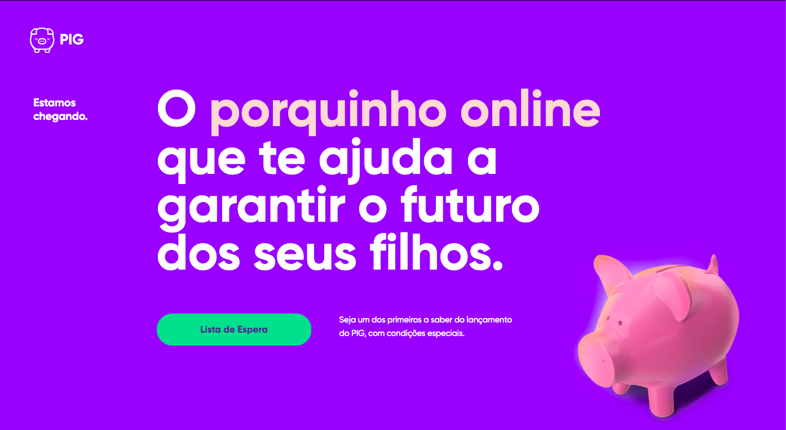

<h1 align="center">PIG - Previdencia In Gaming /h1>

  

<h3 align="center">
1st place - Hacka GR1D - Project PIG
honor dateSep 2019
honor descriptionChallenge: use new models of insurance commercialization using as different solutions that a business platform offers (insurtech).
</h3>

<a href="https://panoramaseguro.com.br/tecnologia/inovacao-em-seguros-aplicativo-gamificado-de-previdencia-privada-e-premiado-no-2o-hacka-gr1d/">https://panoramaseguro.com.br/tecnologia/inovacao-em-seguros-aplicativo-gamificado-de-previdencia-privada-e-premiado-no-2o-hacka-gr1d/</a>

